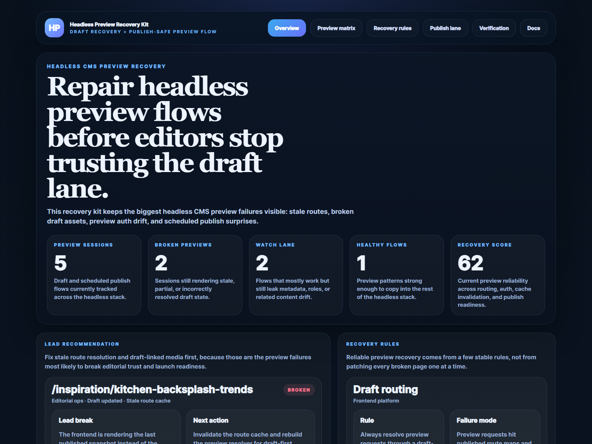
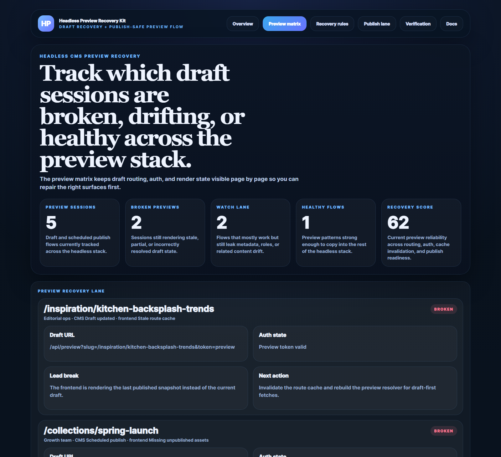
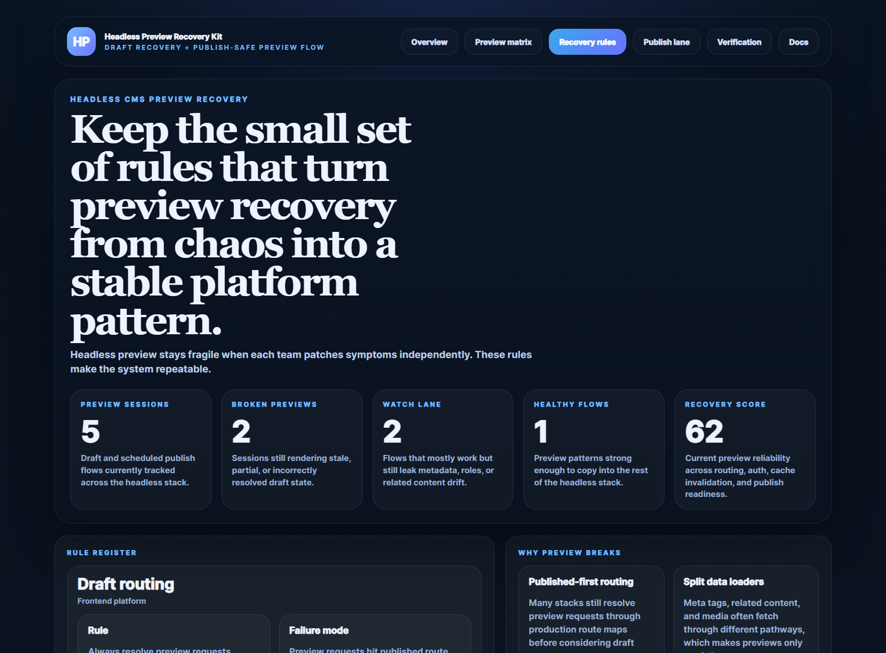
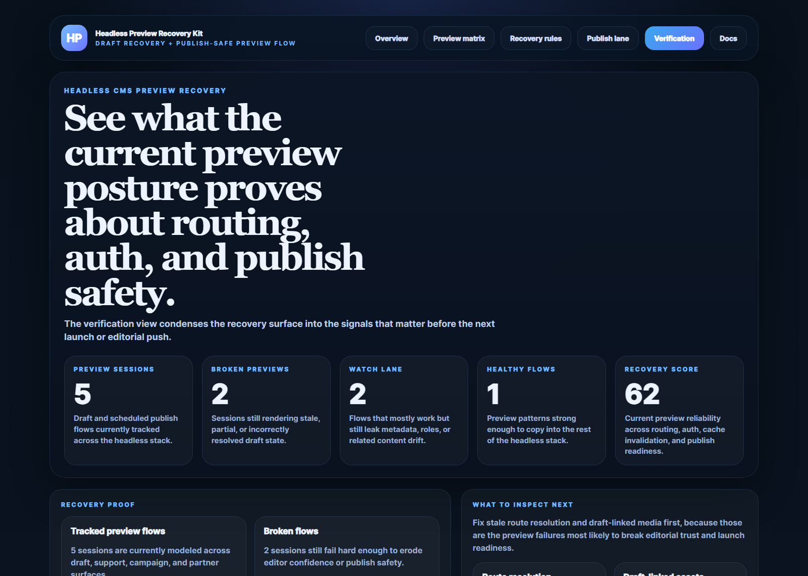

# Headless Preview Recovery Kit

Headless Preview Recovery Kit is a TypeScript control plane for recovering reliable preview flows, draft routing, and publish validation across headless CMS frontends.

It focuses on the real headless preview problems teams keep tripping over:
- stale draft routes
- broken preview auth
- scheduled pages with missing media or metadata
- editors losing trust because preview and publish do not match

## Routes

- `/` overview dashboard
- `/preview-matrix` draft session recovery lane
- `/recovery-rules` stable rules for restoring preview trust
- `/publish-lane` preview-connected publish readiness
- `/verification` proof posture
- `/docs` route and payload reference

## What this repo proves

- headless preview reliability is a platform problem, not only an editorial problem
- route, auth, cache, and media drift all need to be governed together
- preview health should be treated as publish readiness infrastructure
- one healthy preview pattern is worth more than many one-off fixes

## Screenshots






## Local development

```powershell
Set-Location "C:\Users\chaus\dev\repos\headless-preview-recovery-kit"
npm install
npm run dev
```

## Validation

- `npm run build`
- `npm run test`
- `npm run demo`
- `npm run smoke`
- `npm run render:assets`
